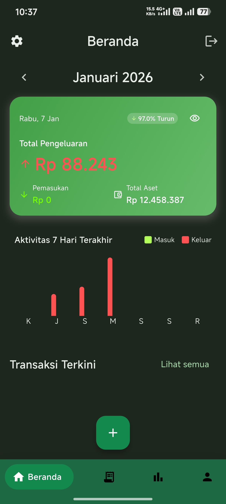
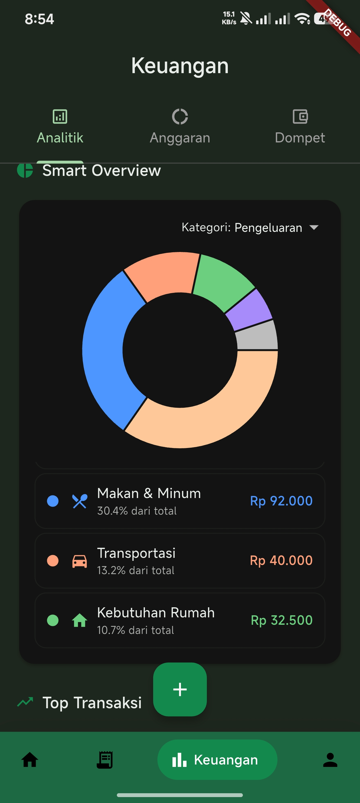
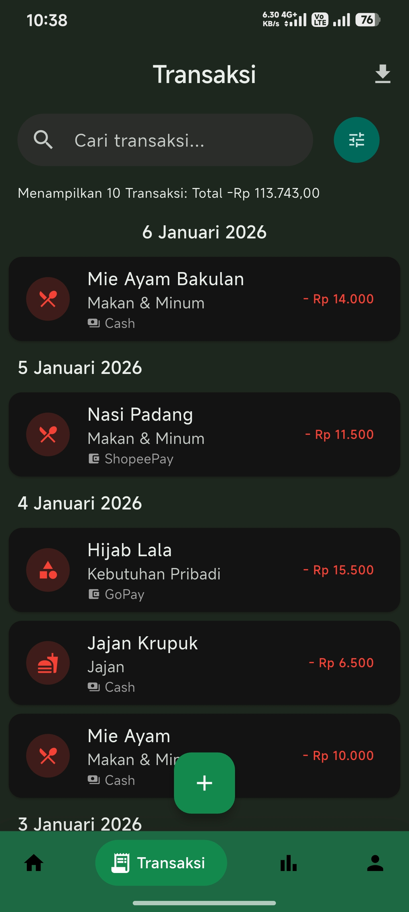
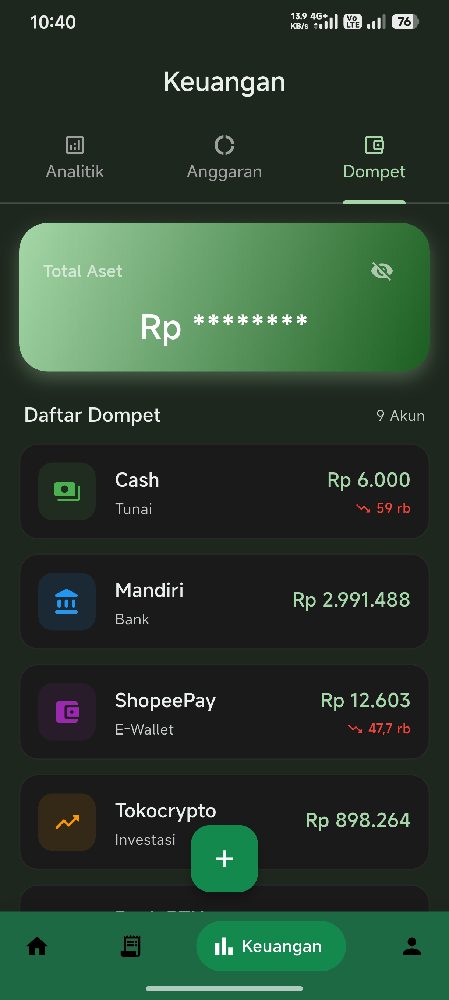
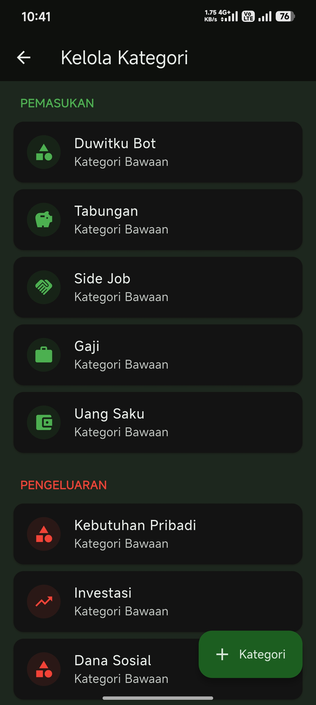
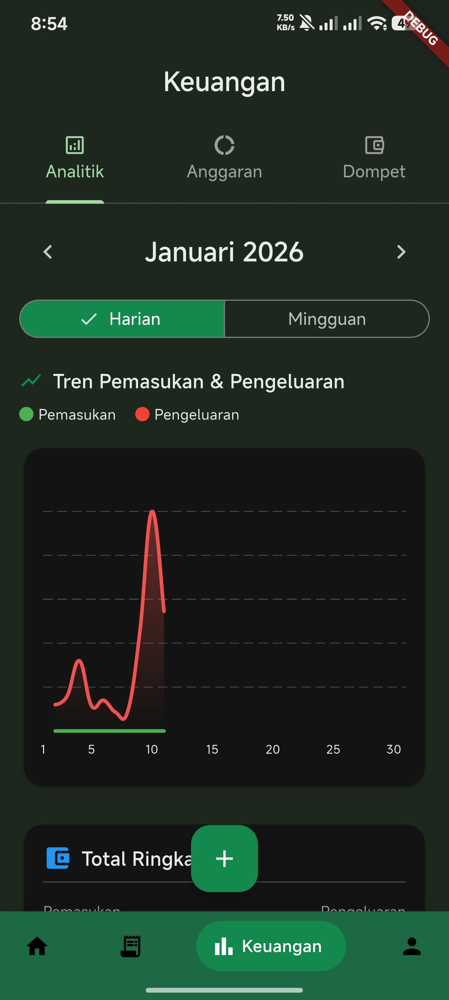
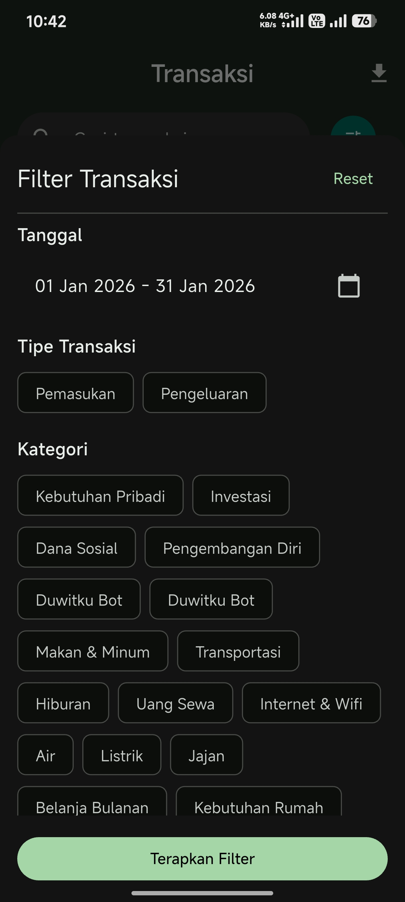
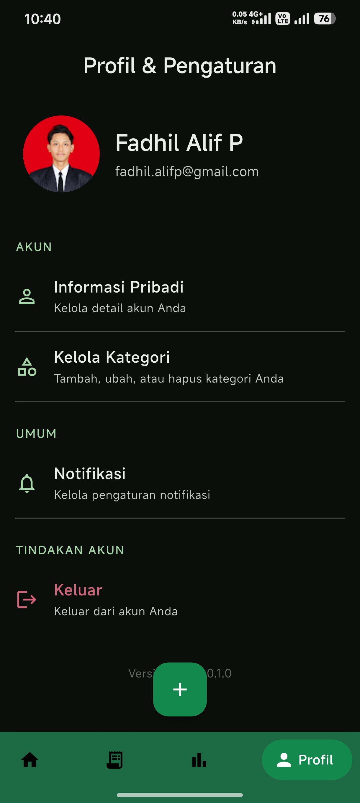
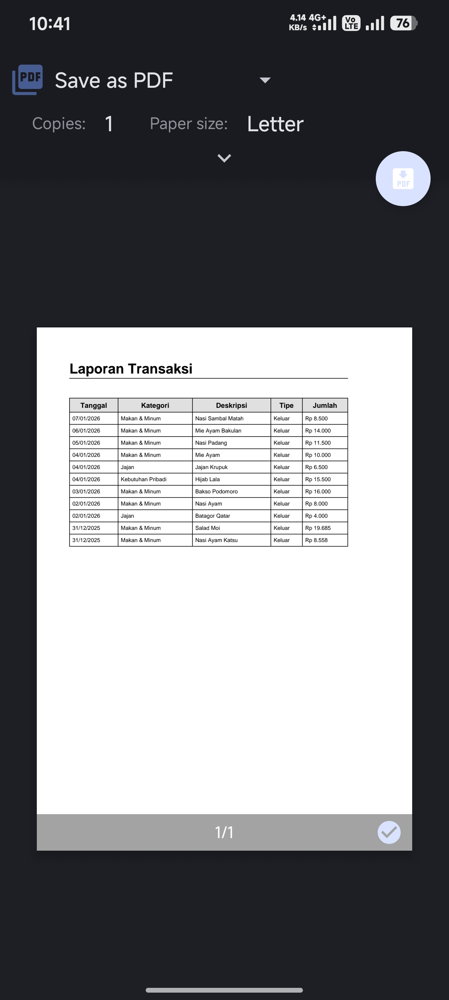

# Duwitku 💰

Duwitku is a comprehensive personal finance management application built with **Flutter**. It is designed to help users effortlessly track expenses, manage budgets, and gain valuable insights into their financial habits through a modern and intuitive interface.

## 📱 Screenshots

<div align="center">
  
  
  
  
</div>

<div align="center">
  
  
  
  
</div>

<div align="center">
  
  
</div>

## ✨ Key Features

- **📊 Smart Dashboard**: Get a quick overview of your total assets, recent transactions, and budget status with smooth loading animations (Skeletonizer).
- **💼 Multi-Wallet Management**: Create and manage multiple wallets (e.g., Cash, Bank, E-wallet) with separate balances and transaction tracking. Toggle balance visibility for privacy.
- **💸 Transaction Management**: Record income and expenses with detailed categories. Support for time selection, wallet assignment, and multiple input methods.
- **🧾 Receipt Scanning**: Scan physical receipts using the camera with advanced lifecycle management and error handling. Automatically process images with AI for transaction extraction.
- **🎤 Voice Input**: Log transactions naturally using speech recognition. Just speak your transaction details, and AI will automatically categorize and parse the information.
- **💰 Budget Planning**: Set monthly budgets for different categories with progress tracking and days remaining indicators.
- **📈 Visual Analytics**: Comprehensive analytics dashboard with interactive charts using `fl_chart`. View spending patterns, category breakdowns, and month-over-month comparisons.
- **🏦 Finance Hub**: Centralized hub with tab navigation for analytics, budgets, and wallet management - all in one place.
- **🤖 AI Assistant**: Integrated Chat Prompt feature powered by Google Gemini AI to assist with financial queries, transaction categorization, and wallet categorization.
- **☁️ Cloud Sync**: Real-time data synchronization and secure storage using **Supabase** with Row Level Security.
- **🔐 Secure Authentication**: Support for Email/Password login and Google Sign-In with phone number verification.
- **📤 Data Export**: Export your financial reports to **CSV** and **PDF** formats using SharePlus for external analysis.
- **🎨 Modern UI**: Beautiful design with **Flex Color Scheme**, supporting adaptive light and dark modes with Material 3.

## 🛠 Tech Stack

This project utilizes a robust and modern tech stack:

- **Framework**: [Flutter](https://flutter.dev/) (Dart)
- **Backend & Auth**: [Supabase](https://supabase.com/)
- **State Management**: [Riverpod](https://riverpod.dev/) (with code generation)
- **Routing**: [GoRouter](https://pub.dev/packages/go_router)
- **HTTP Client**: [Dio](https://pub.dev/packages/dio)
- **UI Libraries**:
  - `flex_color_scheme` for theming
  - `google_nav_bar` for navigation
  - `flutter_slidable` for list actions
  - `skeletonizer` for loading states
  - `fl_chart` for data visualization
- **AI & Speech**:
  - `google_generative_ai` for Gemini AI integration
  - `speech_to_text` for voice input
- **Utils**: `flutter_image_compress`, `image_cropper`, `intl`, `logger`, `share_plus`

## 🏗️ System Architecture

Duwitku implements a multi-platform ecosystem with seamless integration between mobile and messaging platforms:

```text
┌─────────────────────────────────────────────────────────────────┐
│                        User Interfaces                          │
├─────────────────────────────────────────────────────────────────┤
│  📱 Flutter MobileApp        │  💬 WhatsApp Bot (duwitku-bot) │
│  - iOS & Android              │  - WAHA API Integration         │
│  - Receipt Scanning           │  - Natural Language Input       │
│  - Voice Input                │  - AI Auto-Categorization       │
└────────────┬──────────────────┴────────────────┬────────────────┘
             │                                   │
             │         ┌─────────────────────────┘
             │         │
             ▼         ▼
    ┌────────────────────────────────────┐
    │      Supabase Backend (BaaS)       │
    ├────────────────────────────────────┤
    │  🗄️  PostgreSQL Database           │
    │  🔐 Authentication & Authorization │
    │  📦 Storage (Receipt Images)       │
    │  🔄 Real-time Subscriptions        │
    │  🛡️  Row Level Security (RLS)      │
    └────────────┬───────────────────────┘
                 │
                 ▼
    ┌────────────────────────────────────┐
    │      External Services             │
    ├────────────────────────────────────┤
    │  🤖 Google Gemini AI               │
    │     - Receipt OCR & Analysis       │
    │     - Transaction Categorization   |
    |     - Wallet Categorization        │
    │  🔑 Google OAuth                   │
    │     - Social Sign-In               │
    └────────────────────────────────────┘
```

### Architecture Layers

**Presentation Layer** (`views/` & `widgets/`)

- UI screens and reusable components
- Responsive design with Material 3
- Loading states with Skeletonizer

**Business Logic Layer** (`presenters/` & `controllers/`)

- ViewModels for UI logic separation
- Camera controller for receipt scanning
- Form validation and user interactions

**State Management** (`providers/`)

- Riverpod for dependency injection
- Provider-based state management
- Real-time data synchronization

**Data Layer** (`repositories/` & `models/`)

- Repository pattern for data access
- Domain models for type safety
- Supabase client integration

**Service Layer** (`services/`)

- Receipt scanning and OCR
- AI-powered categorization
- Image compression and storage

## 📂 Project Structure

The codebase follows a maintainable and scalable layered architecture:

```text
lib/
├── controllers/    # Business logic and state management
│   └── camera_controller.dart
├── models/         # Data models and entities
│   ├── budget.dart
│   ├── category.dart
│   ├── transaction.dart
│   ├── transaction_filter_state.dart
│   ├── user_profile.dart
│   ├── wallet.dart
│   ├── receipt_item.dart
│   └── camera_model.dart
├── presenters/     # UI Logic and ViewModels
│   └── auth_presenter.dart
├── providers/      # Riverpod providers for dependency injection
│   ├── budget_provider.dart
│   ├── category_provider.dart
│   ├── transaction_provider.dart
│   ├── profile_provider.dart
│   ├── wallet_provider.dart
│   ├── gemini_provider.dart
│   └── ui_provider.dart
├── repositories/   # Data access layer (Supabase integration)
│   ├── budget_repository.dart
│   ├── category_repository.dart
│   ├── transaction_repository.dart
│   ├── profile_repository.dart
│   └── wallet_repository.dart
├── services/       # External services (AI, Receipt, etc.)
│   ├── receipt_service.dart
│   └── gemini_service.dart
├── utils/          # Helper functions and constants
│   ├── router.dart
│   ├── icon_helper.dart
│   └── export_helper.dart
├── views/          # UI Screens
│   ├── auth/
│   ├── home/
│   ├── transaction/
│   ├── budget/
│   ├── analytics/
│   ├── finance_hub/
│   ├── wallet/
│   ├── profile/
│   ├── scan_struk/
│   ├── voice_input/
│   ├── input_phone/
│   └── chat_prompt/
└── widgets/        # Reusable UI components
    └── app_logo.dart
```

## 🗄️ Database Schema

The application uses Supabase PostgreSQL with the following core tables:

### `profiles`

```sql
id                  UUID PRIMARY KEY
email               TEXT UNIQUE
full_name           TEXT
phone_number        TEXT
avatar_url          TEXT
wallet_id           BIGINT REFERENCES wallets(id)
created_at          TIMESTAMP
updated_at          TIMESTAMP
```

### `wallets`

```sql
id                  BIGINT PRIMARY KEY
user_id             UUID REFERENCES profiles(id)
name                TEXT NOT NULL
type                TEXT CHECK (type IN ('cash', 'bank', 'e-wallet', 'investment'))
balance             NUMERIC DEFAULT 0
icon                TEXT
color               TEXT
is_visible          BOOLEAN DEFAULT TRUE
created_at          TIMESTAMP
updated_at          TIMESTAMP
```

### `categories`

```sql
id              BIGINT PRIMARY KEY
user_id         UUID REFERENCES profiles(id)
name            TEXT NOT NULL
type            TEXT CHECK (type IN ('income', 'expense'))
icon            TEXT
color           TEXT
is_default      BOOLEAN DEFAULT FALSE
created_at      TIMESTAMP
```

### `transactions`

```sql
id                  BIGINT PRIMARY KEY
user_id             UUID REFERENCES profiles(id)
category_id         BIGINT REFERENCES categories(id)
wallet_id           BIGINT REFERENCES wallets(id)
amount              NUMERIC NOT NULL
type                TEXT CHECK (type IN ('income', 'expense'))
description         TEXT
transaction_date    TIMESTAMP NOT NULL
receipt_url         TEXT
source_type         TEXT CHECK (source_type IN ('app', 'whatsapp', 'receipt', 'voice'))
created_at          TIMESTAMP
updated_at          TIMESTAMP
```

### `budgets`

```sql
id              BIGINT PRIMARY KEY
user_id         UUID REFERENCES profiles(id)
category_id     BIGINT REFERENCES categories(id)
amount          NUMERIC NOT NULL
period_start    DATE NOT NULL
period_end      DATE NOT NULL
created_at      TIMESTAMP
```

**Security**: All tables implement Row Level Security (RLS) policies to ensure users can only access their own data.

## 💬 WhatsApp Bot Integration

Duwitku extends beyond the mobile app with a **WhatsApp Bot** powered by Gemini AI 2.5 Flash Model, allowing users to log transactions through natural conversation!

### 🤖 [duwitku-bot](https://github.com/FadhilAlif/duwitku-bot)

A complementary service that enables transaction logging via WhatsApp messaging:

**Key Features:**

- 📝 **Natural Language Processing**: Log expenses by simply chatting
- 🤖 **AI Auto-Categorization**: Gemini AI automatically categorizes transactions and wallet
- 💬 **Conversational Interface**: No need to remember specific formats
- 🔄 **Real-time Sync**: Instantly syncs with your Duwitku mobile app
- 📊 **Batch Entry**: Record multiple transactions in one WhatsApp Message

**Example Usage:**

```text
User:
Expenses
Mie ayam 15000 Cash
bensin 50k Cash
kopi 12k Cash
Bot: ✅ 3 transactions recorded and categorized!

Income
User: "duwitku Gajian 5000000 Mandiri"
Bot: ✅ Income recorded: Rp 5,000,000
```

**Tech Stack:**

- [WAHA (WhatsApp HTTP API)](https://waha.devlike.pro/)
- Hono.js for webhook handling
- Google Gemini AI for intelligent categorization
- Docker-ready deployment

👉 **Learn more**: [github.com/FadhilAlif/duwitku-bot](https://github.com/FadhilAlif/duwitku-bot)

## 🔌 API Integrations

### Supabase

- **Authentication**: Email/Password & OAuth providers
- **Database**: PostgreSQL with real-time subscriptions
- **Storage**: Receipt image uploads with public URLs
- **Functions**: Server-side logic execution

### Google Gemini AI

- **Receipt OCR**: Extract text and amounts from receipt images
- **Smart Categorization**: Automatically categorize transactions based on descriptions
- **Natural Language**: Parse conversational input in WhatsApp bot

### Google Sign-In

- **OAuth 2.0**: Seamless authentication
- **Cross-platform**: Works on Android, iOS, and Web

## 🚀 Getting Started

### Prerequisites

- [Flutter SDK](https://docs.flutter.dev/get-started/install) (Version 3.9.2 or higher)
- Supabase Project (for backend)
- Google Cloud Console account (for OAuth)
- Google AI Studio account (for Gemini API)

### Installation

1. **Clone the repository**

   ```bash
   git clone https://github.com/FadhilAlif/duwitku.git
   cd duwitku
   ```

2. **Install Dependencies**

   ```bash
   flutter pub get
   ```

3. **Environment Configuration** ⚠️ **IMPORTANT**

   Create a `.env` file in the root directory by copying from the template:

   ```bash
   cp .env.example .env
   ```

   Then fill in your actual API keys and configuration:

   ```env
   SUPABASE_URL=your_supabase_project_url
   SUPABASE_ANON_KEY=your_supabase_anon_key
   GOOGLE_CLIENT_ID=your_google_oauth_client_id
   GEMINI_API_KEY=your_gemini_api_key
   ```

   **Where to get these keys:**

   - **Supabase**: [Supabase Dashboard](https://app.supabase.com) → Your Project → Settings → API
   - **Google Client ID**: [Google Cloud Console](https://console.cloud.google.com) → APIs & Services → Credentials
   - **Gemini API**: [Google AI Studio](https://makersuite.google.com/app/apikey)

4. **Database Setup**

   Run the SQL migrations in your Supabase project to create the required tables and enable Row Level Security (RLS) policies.

5. **Run the App**

   ```bash
   flutter run
   ```

## 📦 Build & Deployment

### Android

```bash
flutter build apk --release
# or
flutter build appbundle --release
```

## 📄 License

This project is licensed under the MIT License - see the [LICENSE](LICENSE) file for details.

## 👨‍💻 Author

- GitHub: [@FadhilAlif](https://github.com/FadhilAlif)
- LinkedIn: [Fadhil Alif](https://www.linkedin.com/in/fadhilalif/)

## 📞 Support

If you encounter any issues or have questions:

- 🐛 [Report a Bug](https://github.com/FadhilAlif/duwitku/issues)
- 💡 [Request a Feature](https://github.com/FadhilAlif/duwitku/issues)

## 🤝 Contributing

Contributions are welcome! If you have any ideas, suggestions, or bug reports, please open an issue or submit a pull request.
